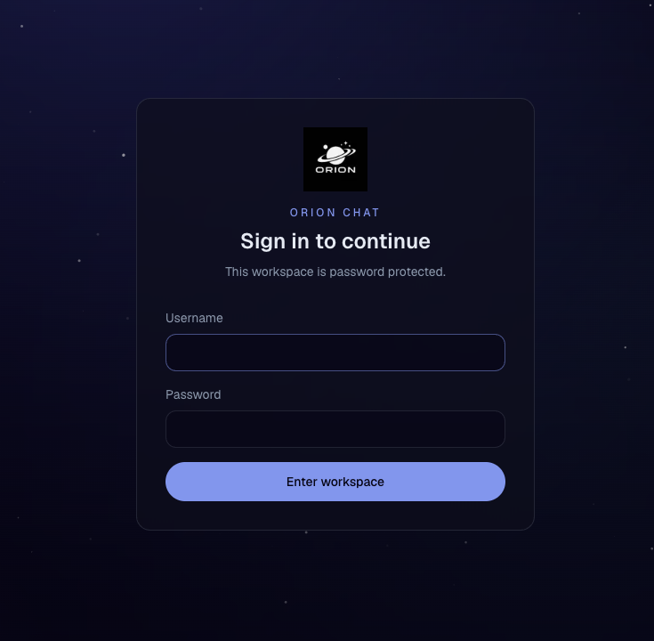
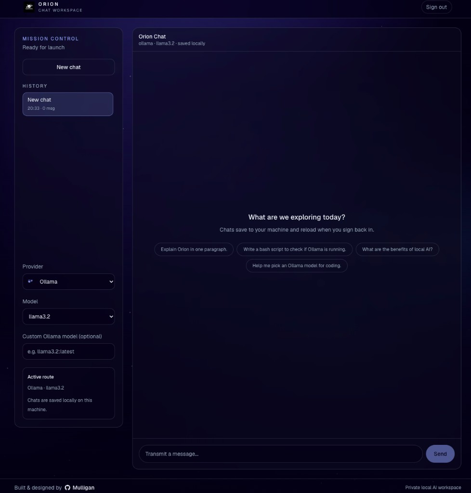

# Orion AI

Self-hosted AI chat workspace — local Ollama, optional cloud providers, password protected.

Inspired by the install flow of [Odysseus](https://github.com/pewdiepie-archdaemon/odysseus).

## Screenshots

**Sign in** — password-protected access to your local workspace.



**Chat workspace** — local Ollama models, saved conversations, optional cloud providers.



## Quick start (Docker)

```bash
git clone https://github.com/Mullign/Orion-AI.git
cd Orion-AI
npm run setup
```

`npm run setup` asks for your username and password, then starts the stack.

Or manually:

```bash
cp .env.example .env
docker compose up -d --build
```

Open **http://127.0.0.1:7080/login** (or **http://127.0.0.1:7080/setup** on first launch).

> **macOS note:** Port 7000 is often used by AirPlay Receiver and can return HTTP 403. Orion defaults to **7080** instead.

### Login credentials

| Situation | Username | Password |
|-----------|----------|----------|
| First launch, no `data/runtime.env` yet | `orion` (from `.env`) | `orion` (from `.env`) |
| After first boot or `/setup` | See `data/runtime.env` | See `data/runtime.env` |

On first boot, Orion writes `./data/runtime.env` with `APP_USERNAME` and `APP_PASSWORD`. **That file overrides `.env`** for login.

To reset credentials and start fresh:

```bash
rm data/runtime.env
docker compose up -d --build
# open http://127.0.0.1:7080/setup
```

If you change `APP_PORT` in `.env`, recreate containers so the port mapping updates:

```bash
docker compose down
docker compose up -d --build
```

### Chat app vs marketing site

| Command | What it runs | URL |
|---------|--------------|-----|
| `docker compose up -d --build` | **Chat app** (Ollama + auth) | http://127.0.0.1:7080 |
| `npm run dev` | Marketing/docs site only | http://127.0.0.1:3000 |

The chat app is **not** started by `npm run dev` at the repo root.

## What's included

| Service | Port | Purpose |
|---------|------|---------|
| **Orion** (chat app) | 7080 | Password-protected AI workspace |
| **Ollama** | 11434 | Local model server (loopback only) |
| **Site** (optional) | 3000 | Marketing/docs — `docker compose --profile site up -d` |

On first boot, Orion pulls the default model (`llama3.2` by default) into Ollama automatically.

## Native development

For working on the chat app without Docker:

```bash
cd chat
npm install
cp .env.example .env.local
# Set APP_USERNAME, APP_PASSWORD, AUTH_SECRET
npm run dev
```

Requires Ollama running locally: `ollama serve` and `ollama pull llama3.2`

From repo root:

```bash
npm run dev        # marketing site on :3000
npm run dev:chat   # chat app on :3001
```

## Configuration

All Docker settings live in the root `.env` (copy from `.env.example`):

- `APP_PORT` — chat app port (default `7080`)
- `OLLAMA_MODEL` — default local model
- `ORION_ADMIN_USER` / `ORION_ADMIN_PASSWORD` — login credentials (set via `npm run setup` or `/setup`)
- `OPENAI_API_KEY`, `ANTHROPIC_API_KEY`, `GOOGLE_GENERATIVE_AI_API_KEY` — optional cloud providers

Runtime auth secrets and chat history are persisted in `./data/` after first boot.

## Useful commands

```bash
npm run setup          # cp .env.example .env && docker compose up -d --build
docker compose logs -f orion
docker compose down
docker compose --profile dev up --build   # hot reload for development
docker compose --profile site up -d       # include marketing site
```

## Providers

Configure in `.env`:

- **Ollama** — bundled, no API key required
- **OpenAI** — `OPENAI_API_KEY`
- **Anthropic** — `ANTHROPIC_API_KEY`
- **Google** — `GOOGLE_GENERATIVE_AI_API_KEY`

Built and designed by [Mulligan](https://github.com/Mullign).
